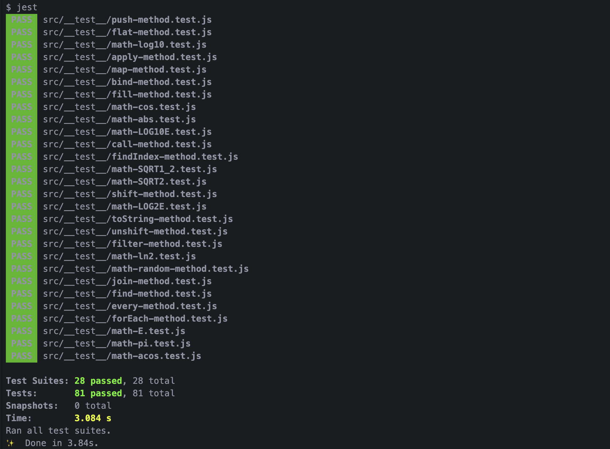

# TESTS FOR JAVASCRIPT METHODS WITH JEST

##### set up

```
 npm install

```

##### run tests

```

 yarn test

 or

 npm run test

```



Jest : Unit tests for the following JS methods:

##### Array.prototype.map()

##### Array.prototype.push()

##### Array.prototype.forEach()

##### Function.prototype.call()

##### Function.prototype.apply()

##### Object.prototype.toString()

##### Function.prototype.bind()

##### Array.prototype.join()

##### Array.prototype.find()

##### Array.prototype.findIndex()

##### Array.prototype.filter()

##### Array.prototype.fill()

##### Array.prototype.flat()

##### Array.prototype.unshift()

##### Array.prototype.shift()

##### Array.prototype.every()

##### Math.random()

##### Math.PI

##### Math.E

##### Math.abs()

##### Math.cos()

##### Math.LN2

##### Math.LOG2E

##### Math.LOG10E

##### Math.SQRT1_2

##### Math.acos()

##### Math.log10()
